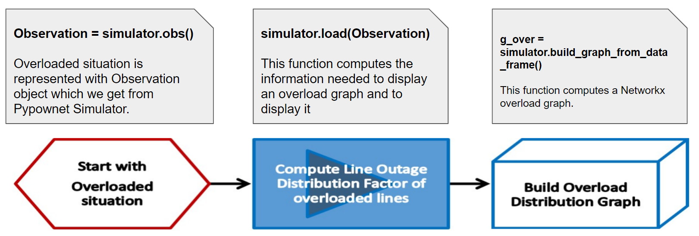
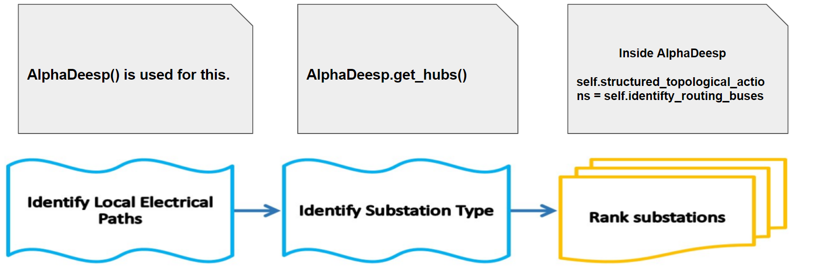
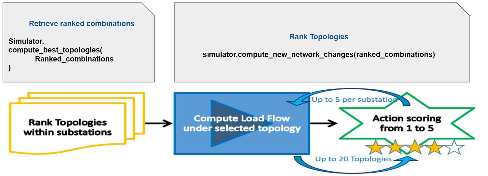

See the documentation at https://expertop4grid.readthedocs.io/en/latest

# ExpertOp4Grid
This is an Expert System which tries to solve a security issue on a power grid, that is on overload over a power line, when it happens. It uses cheap but non-linear topological actions to do, and does not require any training.
For any new overloaded situations, it computes an influence graph around the overload of interest, and rank the substations and topologies to explore to find a solution.
It simulates the top ranked topologies to eventually give a score of success:
* 4 - it solves all overloads,
* 3 - it solves only the overload of interest
* 2 - it partially solves the overload of interest
* 1 - it solves the overload of interest but worsen other overloads
* 0 - it fails. The expert agent is based

It is an implementation of the paper: "Expert system for topological action discovery in smart grids" - https://hal.archives-ouvertes.fr/hal-01897931/file/_LARGE__bf_Expert_System_for_topological_remedial_action_discovery_in_smart_grids.pdf

*Influence Graph example for overloaded line 4->5. The electrical paths highlighted there will help us identify interesting topologies to reroute the flows*


## Installation
Works with 
* Grid2op version: >= 1.5.1
* Pypownet version: 2.2.0 (optional installation)
Could work with other simulation backend if the Simulation Interface is given

To install ExpertOp4Grid execute the following lines: 
##### First clone the repos
`git clone the repository https://github.com/marota/ExpertOp4Grid.git
`

##### Optional: if you want to run in manual mode, install graphviz (for neato package, it allows to transform a dot file into a pdf file). 

Warning: It is important to install graphviz executables before python packages

First install executable

On Linux

`apt-get install graphviz
`

On Windows, use package finder (equivalent of apt-get on Windows)

`winget install graphviz
`

Then ensure that graphviz and neato are in the path. You often have to set it manually. For example on windows you can use the following command line:

`setx /M path "%path%;'C:\Users\username\graphviz-2.38\release\bin"
`

Then you can move to python packages installation


##### Install python packages from setup.py

`pip3 install (-U) .
`
or

`pipenv install (-U) .
`
##### Optional: if you want to run simulation with pypownet instead of Grid2op, install pypownet_fork from libs.

Clone pypownet somewhere else :

`cd ..
git clone https://github.com/MarvinLer/pypownet.git`

Install from within that folder: 

`python setup.py install --user
`

or 

```
cd ExpertOp4Grid
pipenv shell
cd ../pypownet
python setup.py install
```


## Run ExpertOp4Grid

### To execute in **manual mode** on a given power grid snaphsot for a given overloaded line, from root folder, type:
`pipenv run python -m expertop4grid -l 9 -s 0 -c 0 -t 0 `

* -l/--ltc: List of integers representing the lines to cut. For the moment, only one line to cut is handled

* -s/--snapshot: if 1, will generate plots of the different grid topologies managed by alphadeesp and store it in alphadeesp/ressources/output 

* -c/--chronicscenario: integer representing the chronic scenario to consider, starting from 0. By default, the first available chronic scenario will be chosen, i.e. argument is 0

* -t/--timestep: integer representing the timestep number at which we want to run alphadeesp simulation

* -f/--fileconfig: Path to .ini file that provides detailed configuration of the module. If None, a default config.ini is loaded in "this_package_folder/alphaDeesp/ressources/config/config.ini"

In any case, an end result dataframe is written in root folder

In manual mode, further configuration is made through alphadeesp/config.ini

* *simulatorType* - you can chose Grid2op or Pypownet
* *gridPath* - path to folder containing files representing the grid. If no value is provided, a default grid will be loaded (l2rpn_2019) containing one chronic as a simple usecase example
* *outputPath* - path to write outputs in case snapshot mode is activated. If no path is provided, ExpertOp4Grid will write image results in the current working directory (folder named output/grid/linetocut/scenario/timestep) 
* *CustomLayout* - list of couples reprenting coordinates of grid nodes. If not provided, grid2op will load grid_layout.json in grid folder
* *grid2opDifficulty* - "0", "1", "2" or "competition". Be careful: grid datasets should have a difficulty_levels.json
* *7 other constants for alphadeesp computation* can be set in config.ini, with comments within the file 

### To execute in **agent mode** to run the Expert System on a full scenario, please refer to ExpertAgent available in l2rpn-baseline repository

https://github.com/mjothy/l2rpn-baselines/tree/mj-devs/l2rpn_baselines/ExpertAgent

Instead of configuring through config.ini, you can pass a similar python dictionary to the API
 

## ExpertOp4Grid Workflow
The first three steps of the algorithm are about extracting the situation, creating and 
structuring the data that will be needed for the rest of the steps.



At this step there is a Overload Graph coupled with organized data in a Dataframe that will enable to do the rest of the steps.
ExpertOp4Grid needs a NetworkX graph, a DataFrame, and another dictionary with specific data to properly work.



Now all substations are ranked with our expert knowledge, the last steps consist of simulating the top X 
(can be changed in config.ini file)topologies with a simulator and rank them accordingly. 



# TESTS
To launch the test suite: 
`pipenv run python -m pytest --verbose --continue-on-collection-errors -p no:warnings
`

# License information
Copyright 2019-2020 RTE France

    RTE: http://www.rte-france.com

This Source Code is subject to the terms of the Mozilla Public License (MPL) v2 also available 
[here](https://www.mozilla.org/en-US/MPL/2.0/)
