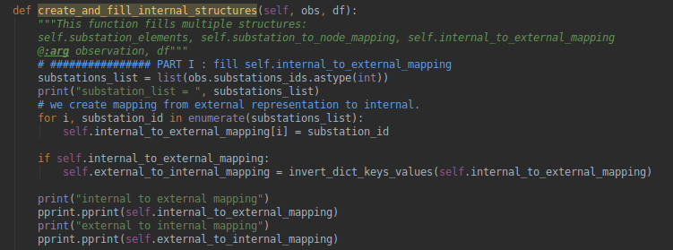
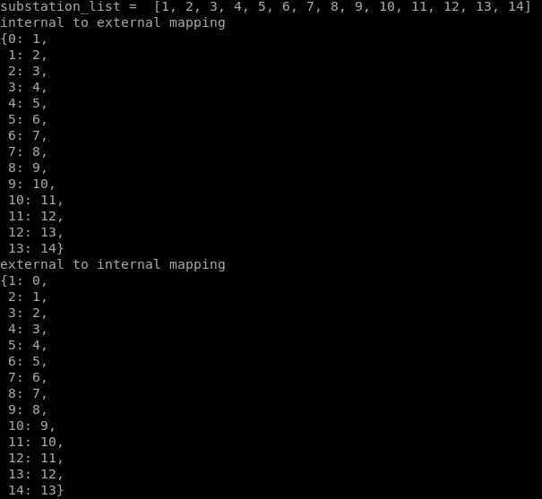
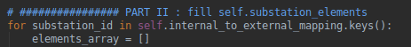
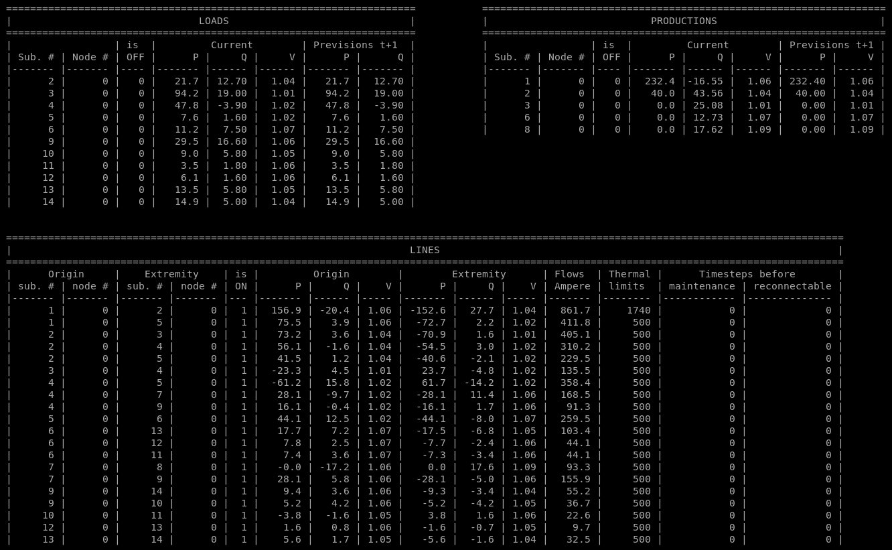
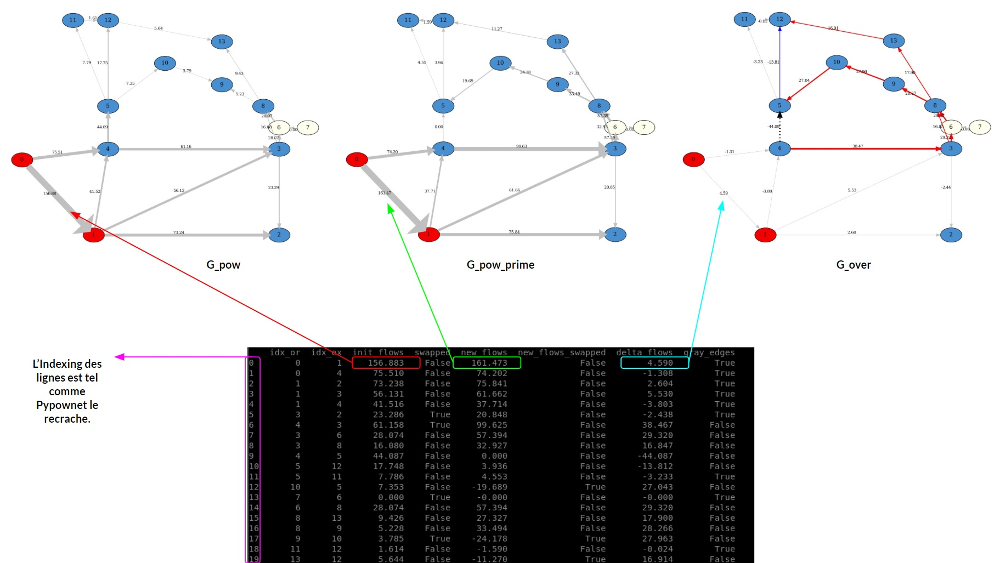
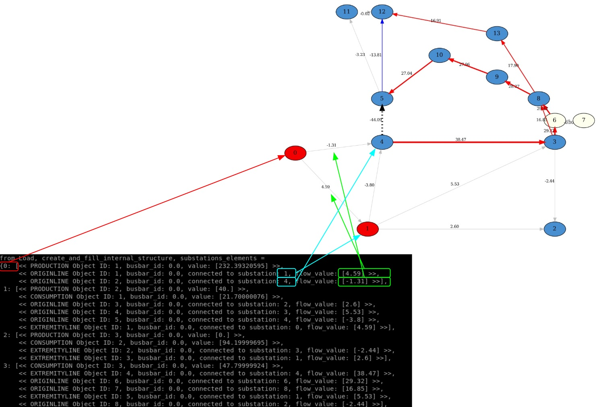
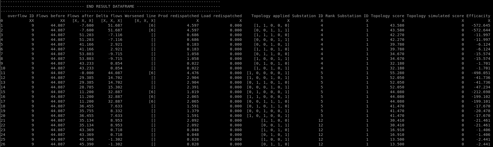
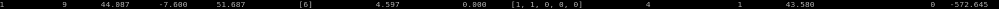
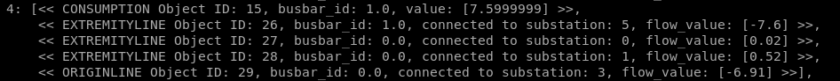
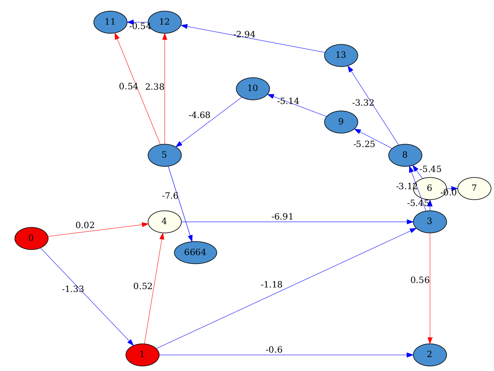

# AlphaDeesp
Works with 
* Grid2op version: >= 1.0.1
* Pypownet version: 2.2.0 (optional installation)


## Installation
To install AlphaDeesp execute the following lines: 
##### First clone the repos
`git clone the repository https://github.com/marota/ExpertOp4Grid.git
`

##### Optional: if you want to run in manual mode, install graphviz (for neato package, it allows to transform a dot file into a pdf file). 

Warning: It is important to install graphviz executables before python packages

First install executable

On Linux

`apt-get install graphviz
`

On Windows, use package finder (equivalent of apt-get on Windows)

`winget install graphviz
`

Then ensure that graphviz and neato are in the path. You often have to set it manually. For example on windows you can use the following command line:

`setx /M path "%path%;'C:\Users\username\graphviz-2.38\release\bin"
`

Then you can move to python packages installation


##### Install python packages from setup.py

`pip3 install (-U) .
`
or

`pipenv install (-U) .
`
##### Optional: if you want to run simulation with pypownet instead of Grid2op, install pypownet_fork from libs.

Clone pypownet somewhere else :

`cd ..
git clone https://github.com/MarvinLer/pypownet.git`

Install from within that folder: 

`python setup.py install --user
`

or 

```
cd ExpertOp4Grid
pipenv shell
cd ../pypownet
python setup.py install
```


## Run Alphadeesp

### To execute in **manual mode**, from root folder, type:
`pipenv run python -m alphaDeesp.main -l 9 -s 0 -c 0 -t 0
`

* -l/--ltc: List of integers representing the lines to cut. For the moment, only one line to cut is handled

* -s/--snapshot: if 1, will generate plots of the different grid topologies managed by alphadeesp and store it in alphadeesp/ressources/output 

* -c/--chronicscenario: integer representing the chronic scenario to consider, starting from 0. By default, the first available chronic scenario will be chosen, i.e. argument is 0

* -t/--timestep: integer representing the timestep number at which we want to run alphadeesp simulation

In any case, an end result dataframe is written in root folder

In manual mode, further configuration is made through alphadeesp/config.ini

* *simulatorType* - you can chose Grid2op or Pypownet
* *gridPath* - path to folder containing files representing the grid
* *CustomLayout* - list of couples reprenting coordinates of grid nodes. If not provided, grid2op will load grid_layout.json in grid folder
* *grid2opDifficulty* - "0", "1", "2" or "competition". Be careful: grid datasets should have a difficulty_levels.json
* *7 other constants for alphadeesp computation* can be set in config.ini, with comments within the file 

### To execute in **agent mode**, please refer to ExpertAgent available in l2rpn-baseline repository

https://github.com/mjothy/l2rpn-baselines/tree/mj-devs/l2rpn_baselines/ExpertAgent

Instead of configuring through config.ini, you can pass a similar python dictionary to the API
 

## Introduction
Simulation work with Grid2op (version >= 1.0.1) or Pypownet (version 2.2.0)

This module represents an expert agent that find solutions to optimise an electric network. The expert agent is based
on a paper: (link)

## Important limitations
Important to know.

* For the moment, we allow cutting only one line when launching the expert system: 
    * ex python3 -m alphaDeesp.main -l 9

* Only works with initial state of all nodes with busbar == 0 (with Pypownet, fixed with Grid2op)

* At the moment, in the internal computation, a substation can have only one source of Power and one source of Consumption (with Pypownet, fixed with Grid2op)

## Data Flow
The Data flow starts with an Observation object, whether from Pypownet or Grid2op API
* First, you load the Observation: simulation.load(Observation)
* Then, it **creates a dictionnary, self.topo**:
    * self.topo["edges"]["idx_or"] = [x for x in idx_or]
    * self.topo["edges"]["idx_ex"] = [x for x in idx_ex]
    * self.topo["edges"]["init_flows"] = current_flows
    * self.topo["nodes"]["are_prods"] = are_prods
    * self.topo["nodes"]["are_loads"] = are_loads
    * self.topo["nodes"]["prods_values"] = prods_values
    * self.topo["nodes"]["loads_values"] = loads_values
* ==> from self.topo dict, a **DataFrame is created**: self.df with column indices being as such (idx_or  idx_ex  init_flows
  swapped  new_flows new_flows_swapped  delta_flows  gray_edges) and row indices being the lines IDs in 
* ==> creates and fill internal structures from DataFrame

Look at the **Explanation** section for more details.

## Explanation

Before heading into a brief explanation of the algorithm

There are three important objects to have in mind:
* g_pow - A powerflow_graph: it displays electricity flow on edges (in MW).


* g_pow_prime - A powerflow_graph: it displays the electricity flow after a line has been cut, here in the example we
can see the line n°9 that has been cut, it now has a value of 0


* g_over - An Overflow graph: it is the result of "g_pow" that got compared to "g_pow_prime". The edge's values
represent the difference between g_pow_prime_edge_value - g_pow_edge_value

**g_over = g_pow_prime - g_pow**


Now, to the main algorithm. The first three steps of the algorithm are about extracting the situation, creating and 
structuring the data that will be needed for the rest of the steps.


At this step there is a Overload Graph coupled with organized data in a Dataframe that will enable to do the rest of the steps.
AlphaDeesp needs a NetworkX graph, a DataFrame, and another dictionary with specific data to properly work.


Now all substations are ranked with our expert knowledge, the last steps consist of simulating the top X 
(can be changed in config.ini file)topologies with a simulator and rank them accordingly. 


explain internal structure, and how another API simulator could be plugged in.

mention at which step you can have a graphical print. (when we can display a graph and where)


# Important Information
There are currently a couple of things that are "hard coded" and therefore should be taken into account if
further work should be done or redone.

If an element (Production, Consumption, OriginLine, ExtremityLine) is on busbar 0 with ID X, 
it will appear on the display graph on node X

However, if an element is on busbar 1 with ID X,
The program will create another node named 666X


# Debug Help
#### To force specific hubs
in AlphaDeesp.compute_best_topo() function, one can force override the hubs result. Check in code, there are
commented examples.

#### To force specific combinations for hubs
If one wants a specific hub, (as shown at the previous line), a user can "force" a specific node combination.
Check in the code, there are commented examples


# TESTS
To launch the test suite: 
`pipenv run python -m pytest --verbose --continue-on-collection-errors -p no:warnings
`


# FAQ DEV

### How to know Lines IDS ?
When starting to use AlphaDeesp, the input arguments are IDs of lines to cut.
How to know line's IDS ?

Line indexing can be found in the object DF_OF_G. 


Check the FAQ Question, What is Df_of_g? [click on this link](#what-is-df_of_g)


### How is a disconnected line represented in the internal structure ?
In the code when we create the internal structure



We get a substations_list and then we create our own proper INTERNAL indexing with the line:

```python
for i, substation_id in enumerate(substations_list):
    self.internal_to_external_mapping[i] = substation_id
```

This produces: 



The next portion of code will loop over that substations_list. 



Substation after substation the program will check all elements and add them to elements_array, meaning, **if
there is NO LINE between node X and node Y, there will be NO SIGN of that in the internal structure.**

PYPOWNET_OBS + DF_OF_G = INTERNAL_STRUCTURE.SUBSTATIONS_ELEMENTS


### What is a  Pypownet Observation ?



### What is Df_of_g ?



### Internal structure dump for g_over: 

IMPORTANT: La representation interne est de style g_over



La meme chose mais avec internal structure dump + explanation
print image here
side by side image with g_over and dump

### Results DataFrame example



### Exemple de g_overdetailed / Topology explained ?


create image
prendre premiere ligne de end result data frame, prendre la topology, et montrer limage de sorti
avec la version detailed
+ en profiter pour expliquer l'encodage de la topologie

On part à partir d'une ligne du resultat, et step by step comme tu ferais sur papier:

EXEMPLE END RESULT DATAFRAME TOPOLOGY ET G_OVER_DETAILED

If we look at the first line in the END_RESULT_DATAFRAME, topology = [1, 1, 0, 0, 0] on SubstationID = 4



If executed with -s, this should have created a snapshot called "4_11000_geo_2020-05-14_19-06_0_.pdf"

The approach to understanding is as follows:

Check the internal_structure for SubstationID 4:



This tell us that the order is as follows: 
[Consumption, Extremity, Extremity, Extremity, Origin] or [C, Ex, Ex, Ex, Or]

So with all those information we can understand how the final topology [1, 1, 0, 0, 0] should look like:

[C, Ex, Ex, Ex, Or]

[1, 1 ,  0,  0, 0]


If we go column by column in order from left to right, it should be as follows:

* [0] The first element Consumption is on Busbar 1 (meaning Node 6664), meaning node will be red.

* [1] The second element Extremity is on BusBar 1 (meaning Node 6664), and we can see it is connected to substation 5. 
So node 6664 is the EXTREMITY of the line going **FROM** 5 **TO** 6664

* [2] The third element Extremity is on BusBar 0 (meaning Node 4), and we see it is connected to substation 0.
So node 4 is the EXTREMITY of the line going **FROM** 0 **TO** 4

* [3] The fourth element Extremity is on BusBar 0 (meaning Node 4), and we can see it is connected to substation 1. 
So node 4 is the EXTREMITY of the line going **FROM** 1 **TO** 4

* [4] The fifth and final element Origin is on BusBar 0 (meaning Node 4), and we can see it is connected to substation 3. 
So node 4 is the ORIGIN of the line going **FROM** 4 **TO** 3

It is exactly how it is displayed with g_over_detailed.




# DOC PATCH NOTES
As of 14.05.2020
* added g_pow, g_pow_prime, g_over examples with a bit more explanation.
* FAQ Df_of_g ressemble à ?
* Une observation Pypownet ressemble à ?
* Explication structure interne avec schémas. 
* Lien END_RESULT_DATAFRAME avec Topology et représentation interne.
* correction BUG : TypeError: unsupported operand type(s) for -: 'NoneType' and 'float' en exécutant: 
python3 -m alphaDeesp.main -l 9 -s
* 