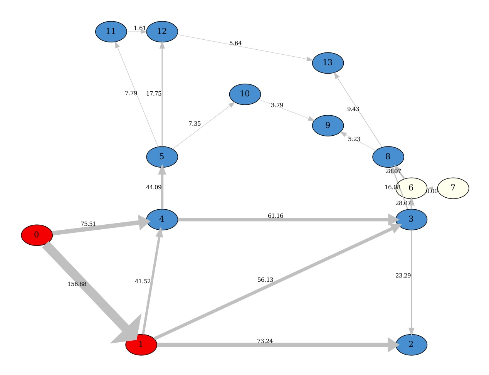
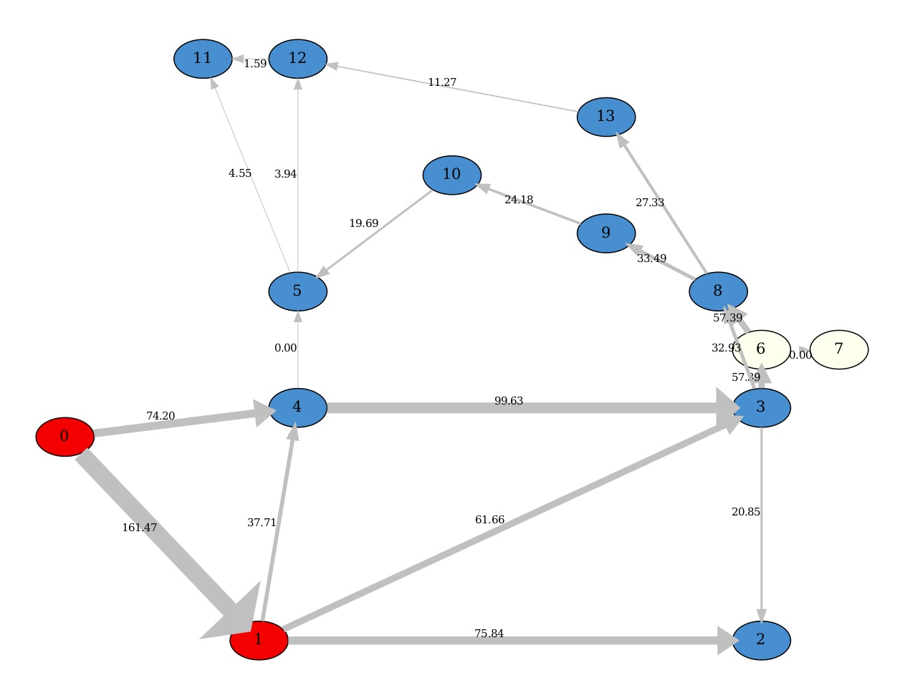
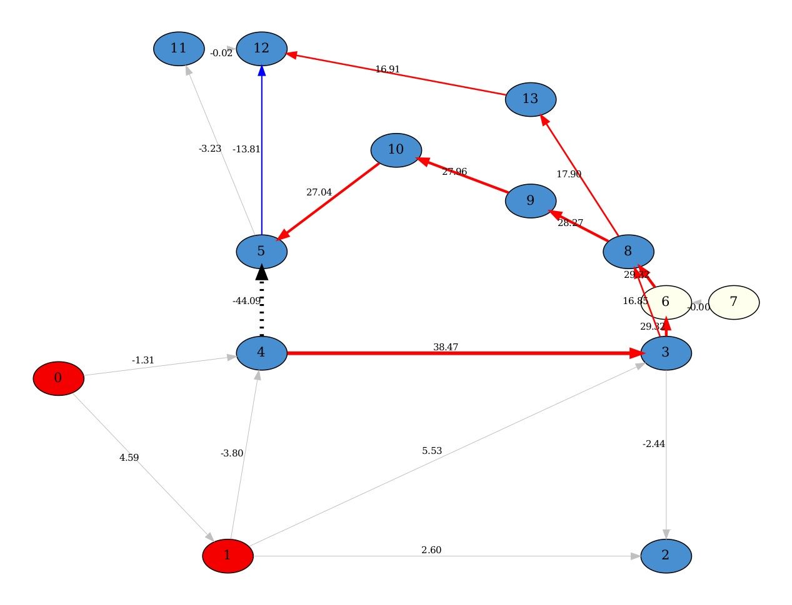

# AlphaDeesp
Works with Pypownet version: 2.2.0

## DATA FLOW
The Data flow starts with a Pypownet Class object named: Observation.
* First, you load the Observation: simulation.load(Observation)
* Then, it **creates a dictionnary, self.topo**:
    * self.topo["edges"]["idx_or"] = [x for x in idx_or]
    * self.topo["edges"]["idx_ex"] = [x for x in idx_ex]
    * self.topo["edges"]["init_flows"] = current_flows
    * self.topo["nodes"]["are_prods"] = are_prods
    * self.topo["nodes"]["are_loads"] = are_loads
    * self.topo["nodes"]["prods_values"] = prods_values
    * self.topo["nodes"]["loads_values"] = loads_values
* ==> from self.topo dict, a **DataFrame is created**: self.df with column indices being as such (idx_or  idx_ex  init_flows
  swapped  new_flows new_flows_swapped  delta_flows  gray_edges) and row indices being the lines IDs in 
* ==> creates and fill internal structures from DataFrame

Look at the **Explanation** section for more details.
    
## IMPORTANT LIMITATIONS
Important to know.

* For the moment, we allow cutting only one line when launching the expert system: 
    * ex python3 -m alphaDeesp.main -l 9

* Only works with initial state of all nodes with busbar == 0 ??

* At the moment, in the internal computation, a substation can have only one source of Power and one source of Consumption.

## Installation
To install AlphaDeesp execute the following lines: 
##### First clone the repos
git clone the https://devin-source.rte-france.com/mozgawam/AlphaDeesp.git

##### Then, being at the root of the project folder,
pip3 install -r requirements.txt --user

##### Install octave:
dzdo dnf install octave-devel

##### Install pypownet_fork from libs.
You can find the version in AlphaDeesp/pypownet_folder/

Install from within that folder: 
Follow installation guide from pypownet. It should be just one command: 
python3 setup.py install --user

##### Install graphviz (for neato package, it allows to transform a dot file into a pdf file):
dzdo dnf install graphviz

## To execute code, from parent folder, type:
python3 -m alphaDeesp.main -l 9 

## Introduction
Only works with Pypownet (version 2.2.0) at the moment

This module represents an expert agent that find solutions to optimise an electric network. The expert agent is based
on a paper: (link)

## Explication
Before heading into a brief explanation of the algorithm

There are three important objects to have in mind:
* g_pow - A powerflow_graph: it displays electricity flow on edges (in MW).

* g_pow_prime - A powerflow_graph: it displays the electricity flow after a line has been cut, here in the example we
can see the line n°9 that has been cut, it now has a value of 0

image here

* g_over - An Overflow graph: it is the result of "g_pow" that got compared to "g_pow_prime". The edge's values
represent the difference between g_pow_edge_value - g_pow_prime_edge_value
**g_over = g_pow - g_pow_prime**

image here

Now, to the main algorithm. The first three steps of the algorithm are about extracting the situation, creating and 
structuring the data that will be needed for the rest of the steps.

At this step there is a Overload Graph coupled with organized data in a Dataframe that will enable to do the rest of the steps.
AlphaDeesp needs a NetworkX graph, a DataFrame, and another dictionary with specific data to properly work.

Now all substations are ranked with our expert knowledge, the last steps consist of simulating the top X 
(can be changed in config.ini file)topologies with a simulator and rank them accordingly. 

explain internal structure, and how another API simulator could be plugged in.

mention at which step you can have a graphical print. (when we can display a graph and where)

# Important Information
There are currently a couple of things that are "hard coded" and therefore should be taken into account if
further work should be done or redone.

If an element (Production, Consumption, OriginLine, ExtremityLine) is on busbar 0 with ID X, 
it will appear on the display graph on node X

However, if an element is on busbar 1 with ID X,
The program will create another node named 666X

# TODOS
explain what critical functions are, for loading observation from pypownet. (in case of Pypownet changes)

explain internal_repr
all elements objects: OriginLine, ExLine, Production, Consumption

In Network init func, In node part, change the np.round by a function that trims not rounds

# Debug Help
#### To force specific hubs
in AlphaDeesp.compute_best_topo() function, one can force override the hubs result. Check in code, there are
commented examples.

#### To force specific combinations for hubs
If one wants a specific hub, (as shown at the previous line), a user can "force" a specific node combination.
Check in the code, there are commented examples

# TODOS virtual func
==> There are multiple functions from Pypownet_Simulation class that can be put as base functions in the base class 
Simulation. Not yet done.

The list of those function is:
==> compute_network_change 
==> ...
==> Finish detailed graph with colored edges
==> Make 2 integration tests with final dataframe verifications

Explain diff between those two functions
    g_over, df_of_g = sim.build_graph_from_data_frame(args.ltc)
    g_over_detailed = sim.build_detailed_graph_from_internal_structure(args.ltc)
And why at force we use on, then the other? 
Is there a way to fuse them ?
    

# LEXICON

#### Overflow Graph:
An Overflow Graph is the result of an "initial graph" init_graph that got compared to a "changed graph" c_graph.
(for example, a "changed graph" c_graph could be same as "initial graph" init_graph but with a splited node or a cutted
 edge) The edge's values represent the difference between initial_graph_edge_value - change_graph_edge_value

overflow_graph = init_graph - c_graph

#### Powerflow Graph:
A Powerflow Graph displays electricity flow on edges.

# TESTS
To launch the test suite: python3 -m pytest --verbose --continue-on-collection-errors -p no:warnings

#### List of all calls to the simulator Pypownet:
make a list here

### NOTES

##### How to know Lines IDS ?
When starting to use AlphaDeesp, the input arguments are IDs of lines to cut.
How to know line's IDS ?

Print save or display an example of the network, to know the line's IDS
example, we would like to cut line between node X and Y ? what line to cut ?

