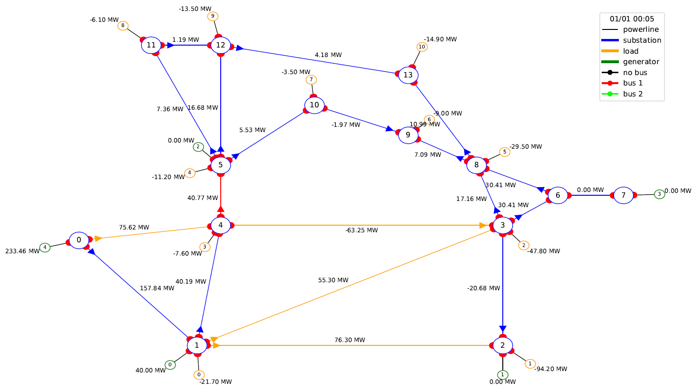

***********
Description
***********

Introduction
============

This module represents an expert agent that finds solutions to optimize a power network. The expert agent is based
on a research paper (https://hal.archives-ouvertes.fr/hal-01897931/file/_LARGE__bf_Expert_System_for_topological_remedial_action_discovery_in_smart_grids.pdf)

Given a power grid and a line in overflow (referred as *Line to cut*) the expert agent will run simulations on the network
and try to find and rank the best topological actions (changing elements of the graph from one bus to the other) to hopefuly solve the overflow.

Workflow overview
=================

We can decompose the Expert System algorithm along those successive steps. Based on the overload distribution graphs it builds, it tries to identify relevant patterns in it described by expert knowledge, to eventually find good spots to reroute the flows. It ranks those substations apriori by relevance and then test them by simulation to get a final score of sucess. Notice that 2 of those steps involves running simulations: it indeed relies on a simulator backend to work.

Workflow implementation
=================

The following picture shows an overview of the different inputs and outputs, and of the major modelisation steps.

.. image:: ../alphaDeesp/ressources/workflow_overview.jpg

Whether entering in manual mode or agent mode, different sets of inputs are provided.

Objects and steps in orange are specific to one given simulator. Two objects are manipulated as such

* ObservationLoader object
* Simulator object

See examples of implementation with Grid2op simulations and Pypownet simulations, in following scripts

* alphaDeesp/core/grid2op/Grid2opObservationLoader.py
* alphaDeesp/core/grid2op/Grid2opSimulation.py
* alphaDeesp/core/pypownet/PypownetObservationLoader.py
* alphaDeesp/core/pypownet/PypownetSimulation.py

It can be substituted by your favorite simulator if it provides the same interface methods and returns the same type of objects to be able to work with AlphaDeesp

Outputs of the process
======================

When called, the main.py/expert_operator.py will return three objects :
``ranked_combinations, expert_system_results, action``

ranked_combinations
^^^^^^^^^^^^^^^^^^^

This dict contains all topological configurations per node, sorted from best to worst by the simulation.

expert_system_results
^^^^^^^^^^^^^^^^^^^^^

The main dataframe presenting quantitative information for all simulated topologies

.. image:: ../alphaDeesp/ressources/end_result_dataframe_extract.jpg

* Simulated flows on the target line (line to cut) before and after topological actions is operated. The delta flow is the difference between both of them
* Worsened lines: new lines that got overloaded or initially overloaded lines which overload increased
* Redispatched Prod: sum of all the production increase or decrease at each generator
* Redispatched Load: difference between the total demand and the actual power supply in all loads (production - losses)
* Internal Topology applied: topology list as used in AlphaDeesp. Represents the bus of each element at the substation (column Substation ID)
* Topology applied: topology list as used in the simulator. Represents the bus of each element at the substation (column Substation ID)
* Substation ID: ID of the substation on which the toology is applied
* Topology score: quantitative score returned by Alphadeesp for this topology
* Topology simulated score: integer score (from 0 to 4) given by the simulator when computing powerflow on the grid after applying the topology 
* Efficacity: flexible quantitative score to be returned by the simulator. It can for instance take into account the reward after applying the topological action 

In manual mode, if option --snapshot is set to 1, plots of all simulated topos graphs are generated to dig into their consequences on the grid powerflow distribution. Plot names are meant to facilitate links between the snapshot and its correspondign line in the dataframe. See plots in the following didactic example.

action
^^^^^^

This list contains all actions (generated by and for the chosen backend) that represent the topological states chosen by Alphadeesp.
Sorted from best to worst, they are a syntactic sugar to give users a direct action to apply to their network.
It is still recommended to parse the main dataframe to understand better what solutions are available.

Didactic example
================

We launch the expert operator in manual mode on the grid l2rpn_2019, with the Grid2opSimulator, on scenario a, at first timestep. There is an overflow on line 9 (between substation 4 and 5), so we provide ltc = 9.
We want to see snapshots of the grid. 

* Command line

``pipenv run python -m alphaDeesp.main -l 9 -s 0 -c 0 -t 0``

* Beginning of config.ini

* Layout of the grid in its current state (also called g_pow)

The simulator will then compute several objects to provide to AlphaDeesp, which will run a greedy algorithm to determine the best topological action to solve the overload.
For more details, see the section *Algorithm Details*

* AlphaDeesp will then output a dataframe will all computed details about the best topologies found.

.. image:: ../alphaDeesp/ressources/dataframe_three_examples.jpg

* The topology surrounded in green has got a 4 simulated score. We can see on the corresponding snapshot that it has resolved the overflow on line 9 by connected two lines to bus 1 at substation 4, which has divided the power flow in amount of line 9

.. image:: ../alphaDeesp/ressources/example_4_score_ltc9.PNG

* The topology surrounded in red has got a 0 simulated score. It does not resolve the power flow

.. image:: ../alphaDeesp/ressources/example_0_score_ltc9.PNG

* The topology surrounded in orange has got a 1 simulated score. It does resolved the power flow on line 9 but created an other one on an other line

Important limitations
=====================

- For the moment, we allow cutting only one line when launching the expert system:
    * ex python3 -m alphaDeesp.main -l 9

- The algorithm will only take the given timestep into account, meaning it will not try to learn from past or future behavior

- **Pypownet only** Only works with initial state of all nodes with busbar == 0

- **Pypownet only** At the moment, in the internal computation, a substation can have only one source of Power and one source of Consumption
