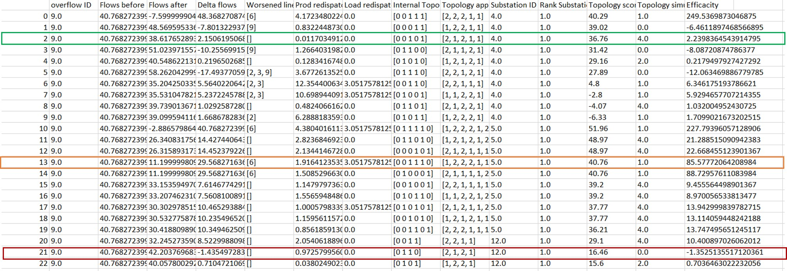
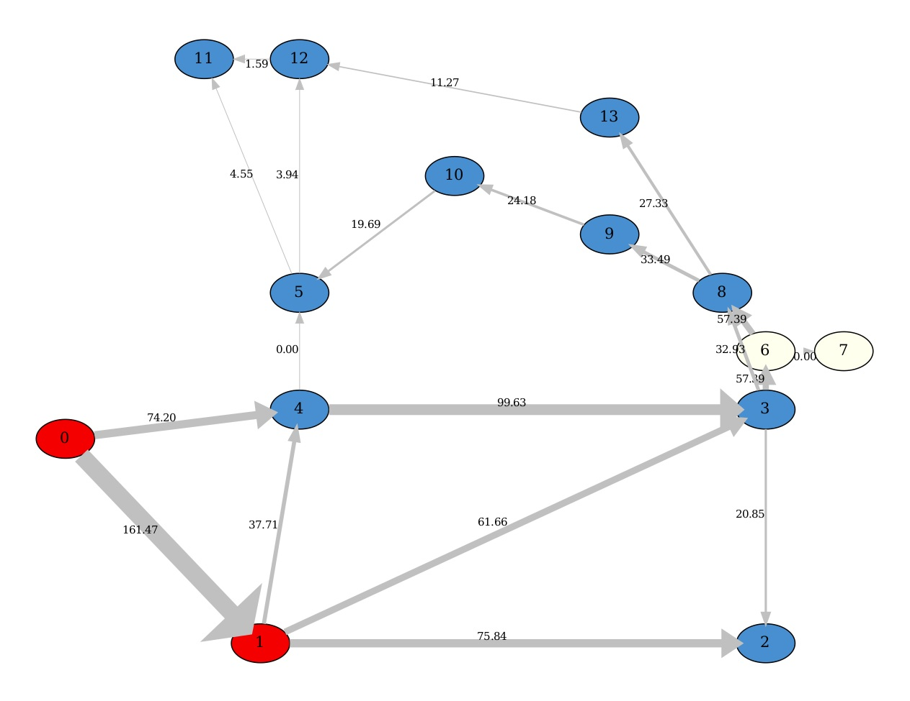
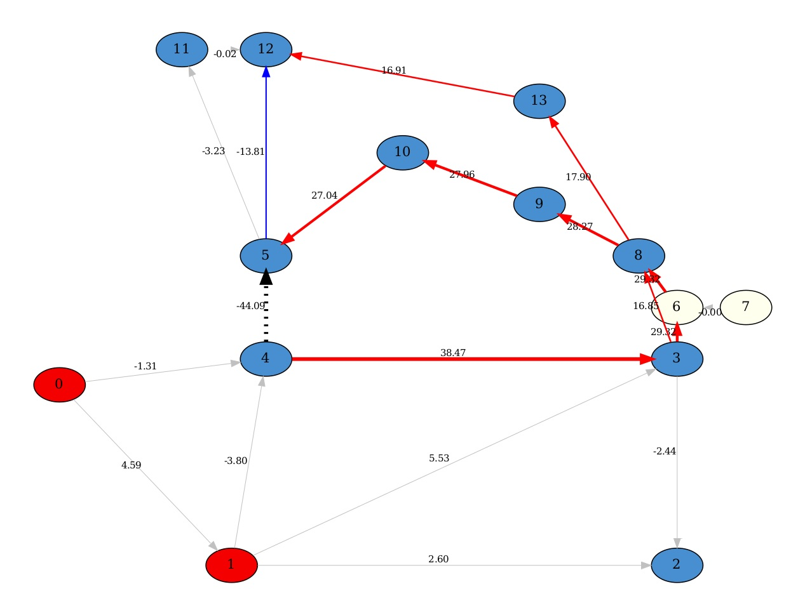
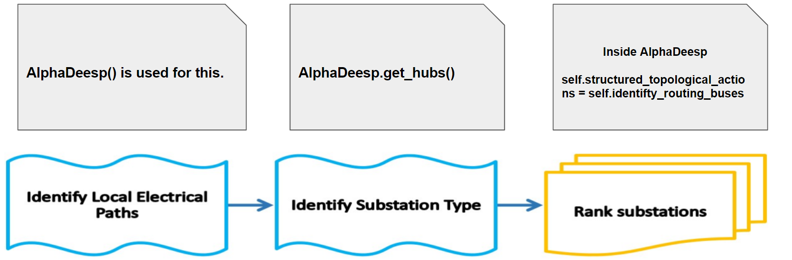

***********
Description
***********

Introduction
============

This module represents an expert agent that finds solutions to optimize a power network. The expert agent is based
on a research paper: (link)

Given a grid object and a line in overflow (referred as *Line to cut*) the expert agent will run simulations on the network
and try to find and rank the best topological actions (changing elements of the graph from one bus to the other) to hopefuly solve the overflow.

Workflow overview
=================

The following picture shows an overview of the different inputs and outputs, and of the major modelisation steps.

Whether entering in manual mode or agent mode, different sets of inputs are provided.

Objects and steps in orange are specific to one given simulator. Two objects are manipulated as such

* ObservationLoader object
* Simulator object

See examples of implementation with Grid2op simulations and Pypownet simulations, in following scripts

* alphaDeesp/core/grid2op/Grid2opObservationLoader.py
* alphaDeesp/core/grid2op/Grid2opSimulation.py
* alphaDeesp/core/pypownet/PypownetObservationLoader.py
* alphaDeesp/core/pypownet/PypownetSimulation.py

It can be substituted by your favorite simulator if it provides the same interface methods and returns the same type of objects to be able to work with AlphaDeesp

Outputs of the process
======================

In any case, the process returns a dataframe presenting quantitative information for all simulated topologies

* Simulated flows on the target line (line to cut) before and after topological actions is operated. The delta flow is the difference between both of them
* Worsened lines: 
* Redispatched Prod: sum of all the production increase or decrease at each generator
* Redispatched Load: difference between the total demand and the actual power supply in all loads (production - losses)
* Internal Topology applied: topology list as used in AlphaDeesp. Represents the bus of each element at the substation (column Substation ID)
* Topology applied: topology list as used in the simulator. Represents the bus of each element at the substation (column Substation ID)
* Substation ID: ID of the substation on which the toology is applied
* Topology score: quantitative score returned by Alphadeesp for this topology
* Topology simulated score: integer score (from 0 to 4) given by the simulator when computing powerflow on the grid after applying the topology 
* Efficacity: flexible quantitative score to be returned by the simulator. It can for instance take into account the reward after applying the topological action 

In manual mode, if option --snapshot is set to 1, plots of all simulated topos are generated to dig into their consequences on the grid powerflow distribution. Plot names are meant to facilitate links between the snapshot and its correspondign line in the dataframe. See plots in the following didactic example.

Didactic example
================

We launch the expert operator in manual mode on the grid l2rpn_2019, with the Grid2opSimulator, on scenario a, at first timestep. There is an overflow on line 9 (between substation 4 and 5), so we provide ltc = 9.
We want to see snapshots of the grid. 

* Command line

``pipenv run python -m alphaDeesp.main -l 9 -s 0 -c 0 -t 0``

* Beginning of config.ini

.. image:: ../alphaDeesp/ressources/config_l2rpn_2019.jpg

* Layout of the grid in its current state

.. image:: ../alphaDeesp/ressources/g_pow_grid2op_ltc9.png

The simulator will then compute several objects to provide to AlphaDeesp

* //TODO: Detail all objects like Marc?

//TODO: explain all the internal functions in ALphadeesp and Simulator which leads to dataframe?

Finaly, here is an extract of the dataframe returned

* The topology surrounded in green has got a 4 simulated score. We can see on the corresponding snapshot that it has resolved the overflow on line 9 by connected two lines to bus 1 at substation 4, which has divided the power flow in amount of line 9

.. image:: ../alphaDeesp/ressources/example_4_score_ltc9.png

* The topology surrounded in red has got a 0 simulated score. It does not resolve the power flow

.. image:: ../alphaDeesp/ressources/example_0_score_ltc9.png

* The topology surrounded in orange has got a 1 simulated score. It does resolved the power flow on line 9 but created an other one on an other line

.. image:: ../alphaDeesp/ressources/example_1_score_ltc9.png

PREVIOUS FROM MARC
==================

Before heading into a brief explanation of the algorithm

There are three important objects to have in mind:

* g_pow - A powerflow_graph: it displays electricity flow on edges (in MW).

.. image:: ../alphaDeesp/ressources/g_pow_print.jpg

* g_pow_prime - A powerflow_graph: it displays the electricity flow after a line has been cut, here in the example we
can see the line n°9 that has been cut, it now has a value of 0

* g_over - An Overflow graph: it is the result of "g_pow" that got compared to "g_pow_prime". The edge's values represent the difference between g_pow_prime_edge_value - g_pow_edge_value

**g_over = g_pow_prime - g_pow**

Now, to the main algorithm. The first three steps of the algorithm are about extracting the situation, creating and
structuring the data that will be needed for the rest of the steps.

.. image::  ../alphaDeesp/ressources/first_line_algorithm_es_.png

At this step there is a Overload Graph coupled with organized data in a Dataframe that will enable to do the rest of the steps.
AlphaDeesp needs a NetworkX graph, a DataFrame, and another dictionary with specific data to properly work.

Now all substations are ranked with our expert knowledge, the last steps consist of simulating the top N
(can be changed in config.ini file) topologies with a simulator and rank them accordingly.

.. image:: ../alphaDeesp/ressources/third_line_algorithm_es_.png

explain internal structure, and how another API simulator could be plugged in.

mention at which step you can have a graphical print. (when we can display a graph and where)

Important limitations
=====================

- For the moment, we allow cutting only one line when launching the expert system:
    * ex python3 -m alphaDeesp.main -l 9

- The agent will only take the given timestep into account, meaning it will not try to learn from past or future behavior

- **Pypownet only** Only works with initial state of all nodes with busbar == 0

- **Pypownet only** At the moment, in the internal computation, a substation can have only one source of Power and one source of Consumption