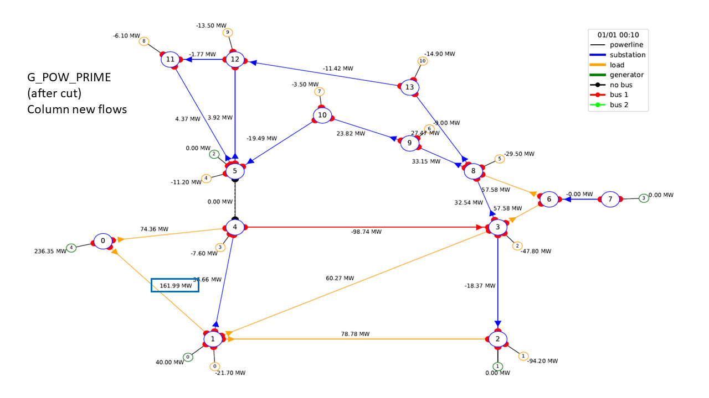
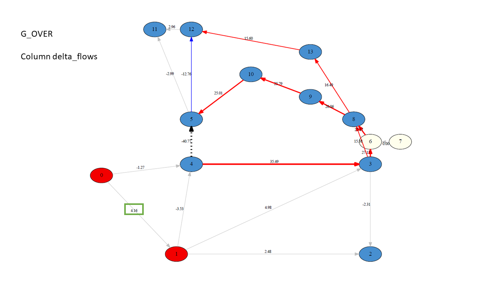

****************************
AlphaDeesp algorithm details
****************************

Call
====

Calling the alphaDeesp engine is done like so :

``alphadeesp = AlphaDeesp(g_over, df_of_g, custom_layout, printer, simulator_data,sim.substation_in_cooldown, debug = debug)``
``ranked_combinations = alphadeesp.get_ranked_combinations()``

Alphadeesp hence gives you an oredered list of substations and topologies that should be relevant to solve your overload

Inputs
======
The following inputs will be required to be computed by the Simulation override.

* ``g_over``
    A newtorkx graph representation of the grid with flow values

* ``df_of_g``
    A dataframe representing a detailed view of the graph

* ``custom_layout``
    The layout of the graph (list of (X,Y) coordinate for edges. Used for plotting.

* ``printer``
    A printer service for logs and graphs

* ``simulator_data``
    A dict composed of :

    * ``substations_elements``
        A local representation of the network from G_OVER (G_POW - G_POW_PRIME) using AlphaDeesp model objects from ``network.py``

        Each PRODUCTION or CONSUMPTION has the value of G_POW (the initial values)

        Each ORIGINLINE or EXTREMITYLINE has the values of flow(G_POW) - flow(G_POW_PRIME)

            {
                \0: [
                    PRODUCTION Object ID: 1, busbar_id: 0, value: 233.4587860107422 ,

                    ORIGINLINE Object ID: 1, busbar_id: 0, connected to substation: 1, flow_value: [4.16] ,

                    ORIGINLINE Object ID: 2, busbar_id: 0, connected to substation: 4, flow_value: [-1.27] ],

                \1: [
                    PRODUCTION Object ID: 2, busbar_id: 0, value: 40.0 ,

                    CONSUMPTION Object ID: 1, busbar_id: 0, value: 21.700000762939453 ,

                    ORIGINLINE Object ID: 3, busbar_id: 0, connected to substation: 2, flow_value: [2.48] ,

                    ORIGINLINE Object ID: 4, busbar_id: 0, connected to substation: 3, flow_value: [4.98] ,

                    ORIGINLINE Object ID: 5, busbar_id: 0, connected to substation: 4, flow_value: [-3.53] ,

                    EXTREMITYLINE Object ID: 1, busbar_id: 0, connected to substation: 0, flow_value: [4.16] ],

                \2: [
                    PRODUCTION Object ID: 3, busbar_id: 0, value: 0.0 ,

                    CONSUMPTION Object ID: 2, busbar_id: 0, value: 94.19999694824219 ,

                    EXTREMITYLINE Object ID: 2, busbar_id: 0, connected to substation: 3, flow_value: [-2.31] ,

                    EXTREMITYLINE Object ID: 3, busbar_id: 0, connected to substation: 1, flow_value: [2.48] ],

                \3: [
                    CONSUMPTION Object ID: 3, busbar_id: 0, value: 47.79999923706055 ,

                    EXTREMITYLINE Object ID: 4, busbar_id: 0, connected to substation: 4, flow_value: [35.49] ,

                    ORIGINLINE Object ID: 6, busbar_id: 0, connected to substation: 6, flow_value: [27.17] ,

                    ORIGINLINE Object ID: 7, busbar_id: 0, connected to substation: 8, flow_value: [15.38] ,

                    EXTREMITYLINE Object ID: 5, busbar_id: 0, connected to substation: 1, flow_value: [4.98] ,

                    ORIGINLINE Object ID: 8, busbar_id: 0, connected to substation: 2, flow_value: [-2.31] ],

                \4: [
                    CONSUMPTION Object ID: 4, busbar_id: 0, value: 7.599999904632568 ,

                    ORIGINLINE Object ID: 9, busbar_id: 0, connected to substation: 5, flow_value: [-40.77] ,

                    EXTREMITYLINE Object ID: 6, busbar_id: 0, connected to substation: 0, flow_value: [-1.27] ,

                    EXTREMITYLINE Object ID: 7, busbar_id: 0, connected to substation: 1, flow_value: [-3.53] ,

                    ORIGINLINE Object ID: 10, busbar_id: 0, connected to substation: 3, flow_value: [35.49] ],

                \5: [
                    PRODUCTION Object ID: 4, busbar_id: 0, value: 0.0 ,

                    CONSUMPTION Object ID: 5, busbar_id: 0, value: 11.199999809265137 ,

                    ORIGINLINE Object ID: 11, busbar_id: 0, connected to substation: 12, flow_value: [-12.76] ,

                    ORIGINLINE Object ID: 12, busbar_id: 0, connected to substation: 11, flow_value: [-2.99] ,

                    EXTREMITYLINE Object ID: 8, busbar_id: 0, connected to substation: 10, flow_value: [25.01] ,

                    EXTREMITYLINE Object ID: 9, busbar_id: 0, connected to substation: 4, flow_value: [-40.77] ],

                \6: [
                    EXTREMITYLINE Object ID: 10, busbar_id: 0, connected to substation: 7, flow_value: [0.0] ,

                    ORIGINLINE Object ID: 13, busbar_id: 0, connected to substation: 8, flow_value: [27.17] ,

                    EXTREMITYLINE Object ID: 11, busbar_id: 0, connected to substation: 3, flow_value: [27.17] ],

                \7: [
                    PRODUCTION Object ID: 5, busbar_id: 0, value: 0.0 ,

                    ORIGINLINE Object ID: 14, busbar_id: 0, connected to substation: 6, flow_value: [0.0] ],

                \8: [
                    CONSUMPTION Object ID: 6, busbar_id: 0, value: 29.5 ,

                    ORIGINLINE Object ID: 15, busbar_id: 0, connected to substation: 13, flow_value: [16.49] ,

                    ORIGINLINE Object ID: 16, busbar_id: 0, connected to substation: 9, flow_value: [26.06] ,

                    EXTREMITYLINE Object ID: 12, busbar_id: 0, connected to substation: 3, flow_value: [15.38] ,

                    EXTREMITYLINE Object ID: 13, busbar_id: 0, connected to substation: 6, flow_value: [27.17] ],

                \9: [
                    CONSUMPTION Object ID: 7, busbar_id: 0, value: 9.0 ,

                    ORIGINLINE Object ID: 17, busbar_id: 0, connected to substation: 10, flow_value: [25.79] ,

                    EXTREMITYLINE Object ID: 14, busbar_id: 0, connected to substation: 8, flow_value: [26.06] ],

                \10: [
                    CONSUMPTION Object ID: 8, busbar_id: 0, value: 3.5 ,

                    ORIGINLINE Object ID: 18, busbar_id: 0, connected to substation: 5, flow_value: [25.01] ,

                    EXTREMITYLINE Object ID: 15, busbar_id: 0, connected to substation: 9, flow_value: [25.79] ],

                \11: [
                    CONSUMPTION Object ID: 9, busbar_id: 0, value: 6.099999904632568 ,

                    EXTREMITYLINE Object ID: 16, busbar_id: 0, connected to substation: 12, flow_value: [2.96] ,

                    EXTREMITYLINE Object ID: 17, busbar_id: 0, connected to substation: 5, flow_value: [-2.99] ],

                \12: [
                    CONSUMPTION Object ID: 10, busbar_id: 0, value: 13.5 ,

                    EXTREMITYLINE Object ID: 18, busbar_id: 0, connected to substation: 13, flow_value: [15.6] ,

                    EXTREMITYLINE Object ID: 19, busbar_id: 0, connected to substation: 5, flow_value: [-12.76] ,

                    ORIGINLINE Object ID: 19, busbar_id: 0, connected to substation: 11, flow_value: [2.96] ],

                \13: [
                    CONSUMPTION Object ID: 11, busbar_id: 0, value: 14.899999618530273 ,

                    EXTREMITYLINE Object ID: 20, busbar_id: 0, connected to substation: 8, flow_value: [16.49] ,

                    ORIGINLINE Object ID: 20, busbar_id: 0, connected to substation: 12, flow_value: [15.6] ]

            }

    * ``substation_to_node_mapping``

    * ``internal_to_external_mapping``
        A dict linking the substation ids from substations_elements (internal) to the observation substations (external)
    .. image:: ../alphaDeesp/ressources/internal_to_external_mapping_explanation_console.png

* ``substation_in_cooldown``
    List of substation that are in cooldown

* ``debug``
    Boolean flag for debugging purposes

Outputs
=======
The alphaDeesp object then provides a list : ``ranked_combinations``

This is a list of dataframes with the following columns :

* ``score``
    the score of the topology from 0(worst) to 4(best)
* ``topology``
    An array of integers (bus_ids) showing the topology of a node
* ``node``
    The node on which the topology was applied

Simulating AlphaDeesp suggestions
====

This ranked_combinations list is then used to simulate all topologies with the Simulation override :
``expert_system_results, actions = sim.compute_new_network_changes(ranked_combinations)``

You eventually know which selected topologies are indeed successful.

Last Note
====
AlphaDeesp substation and topology rankings could be improved to make the selection of actions always more relevant and efficient.
