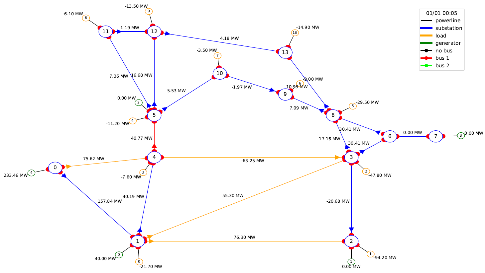
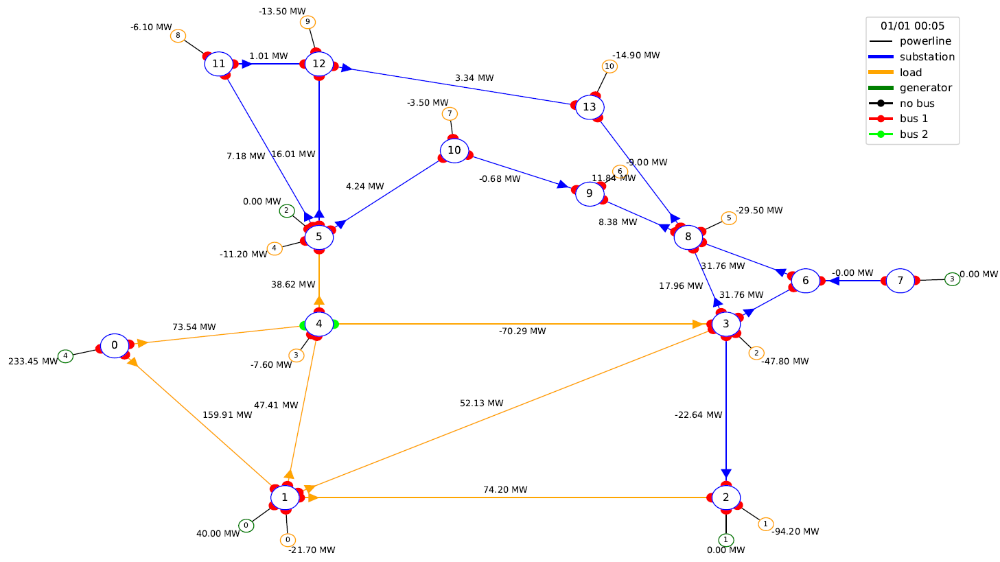

***************
Getting Started
***************

Manual Mode
===========

To execute in **manual mode**, type:
``expertop4grid -l 9 -s 0 -c 0 -t 0``

--ltc | -l int
                            Integer representing the line to cut.
                            For the moment, only one line to cut is handled
--snapshot | -s int
                            If 1, will generate plots of the different grid topologies
                            managed by alphadeesp and store it in alphadeesp/ressources/output
--chronicscenario | -c string
                            Name of the folder containing the chronic scenario to consider
                            By default, the first available folder will be chosen
--timestep | -t int
                            Integer representing the timestep number at
                            which we want to run alphadeesp simulation
--fileconfig | -f string
                            Path to .ini file that provides detailed configuration of the module. If none is provided, a default config.ini is provided in package

In any case, an end result dataframe is written in root folder.

If you run the same command with '-s 1' to print the plots, you will indeed see that:

* On the intial state, you had an overflow to solve

* The expert system indeed finds a solution topology for it at substation 4

See **Algorithm Description section** to learn more about the workflow and results.

In manual mode, further configuration is made through alphadeesp/config.ini

* *simulatorType* - you can chose Grid2op or Pypownet
* *gridPath* - path to folder containing files representing the grid. If no value is provided, a default grid will be loaded (l2rpn_2019) containing one chronic as a simple usecase example
* *outputPath* - path to write outputs in case snapshot mode is activated. If no path is provided, ExpertOp4Grid will write image results in the current working directory (folder named output/grid/linetocut/scenario/timestep) 
* *CustomLayout* - list of couples reprenting coordinates of grid nodes. If not provided, grid2op will load grid_layout.json in grid folder
* *grid2opDifficulty* - "0", "1", "2" or "competition". Be careful: grid datasets should have a difficulty_levels.json
* *7 other constants for alphadeesp computation* can be set in config.ini, with comments within the file

Agent Mode
==========

To execute in **agent mode**, please refer to ExpertAgent available in l2rpn-baseline repository

https://github.com/mjothy/l2rpn-baselines/tree/mj-devs/l2rpn_baselines/ExpertAgent

Instead of configuring through config.ini, you can pass a similar python dictionary to the API

Tests
=====

To launch the test suite in git repo:
``pipenv run python -m pytest --verbose --continue-on-collection-errors -p no:warnings``

Debug Help
==========
- To force specific hubs
in AlphaDeesp.compute_best_topo() function, one can force override the hubs result. Check in code, there are
commented examples.

- To force specific combinations for hubs
If one wants a specific hub, a user can "force" a specific node combination.
Check in the code, there are commented examples
