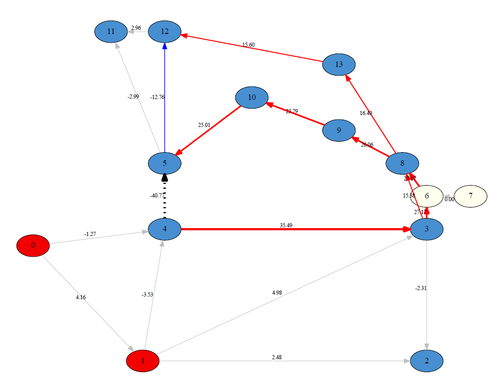

Mentions
=======

Quick Overview
--------

This is an Expert System which tries to solve a security issue on a power grid, that is on overload over a power line, when it happens. It uses cheap but non-linear topological actions to do so, and does not require any training. For any new overloaded situations, it computes an influence graph around the overload of interest, and rank the substations and topologies to explore, to find a solution. It simulates the top ranked topologies to eventually give a score of success:

4 - it solves all overloads,
3 - it solves only the overload of interest
2 - it partially solves the overload of interest
1 - it solves the overload of interest but worsen other overloads
0 - it fails. The expert agent is based
It is an implementation of the paper: "Expert system for topological action discovery in smart grids" - https://hal.archives-ouvertes.fr/hal-01897931/file/_LARGE__bf_Expert_System_for_topological_remedial_action_discovery_in_smart_grids.pdf

Influence Graph example for overloaded line 4->5. The electrical paths highlighted there will help us identify interesting topologies to reroute the flows.

Features
--------

- Analyse a power network when a line is in overflow
- Run simulations to understand the network constraints
- Return a ranking of topological actions that would solve the overflow, or reduce it
- If ran manually (through command line), can also output a series of graph to help visualise the state of the network

Contribute
----------

- Issue Tracker: https://github.com/marota/ExpertOp4Grid/issues
- Source Code: https://github.com/marota/ExpertOp4Grid

Support
-------

If you are having issues, please let us know.
We have a discord located at: $discordlink

License
-------
Copyright 2019-2020 RTE France

    RTE: http://www.rte-france.com

This Source Code is subject to the terms of the Mozilla Public License (MPL) v2.
